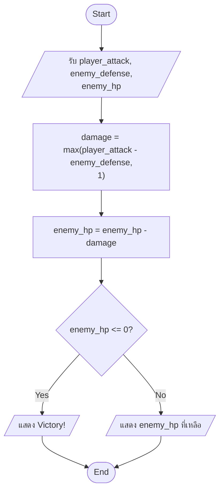
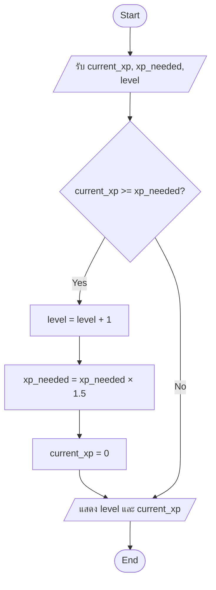
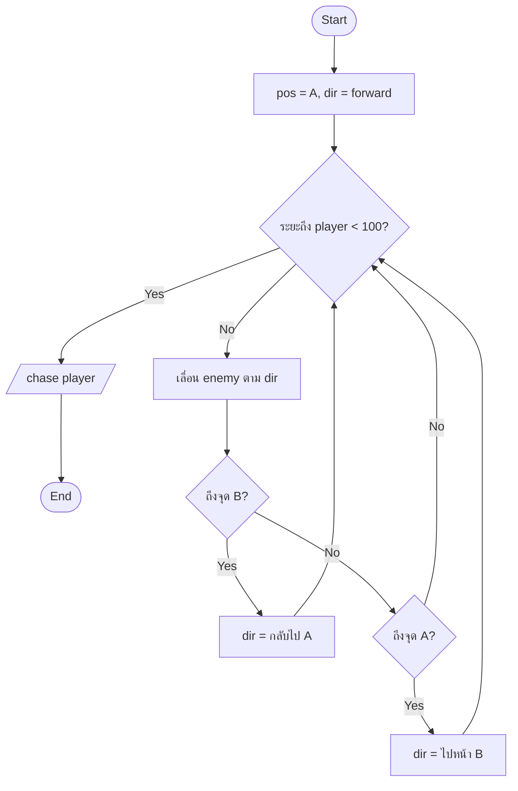

```mermaid
flowchart TD
Start([Start]) --> Input[/รับ player_attack, enemy_defense,
enemy_hp/]
Input --> Calc["damage = max(player_attack - enemy_defense,
1)"]
Calc --> Reduce["enemy_hp = enemy_hp - damage"]
Reduce --> D1{enemy_hp <= 0?}
D1 -->|Yes| Win[/แสดง Victory!/]
D1 -->|No| Show[/แสดง enemy_hp ที่เหลือ/]
Win & Show --> End([End])
```

```mermaid
flowchart TD
Start([Start]) --> Input[/รับ current_xp, xp_needed,
level/]
Input --> A{"current_xp >= xp_needed?"}
A --> |Yes| level["level = level + 1"]
level --> xpneed["xp_needed = xp_needed × 1.5"]
xpneed --> currentxp["current_xp = 0"]
currentxp --> B[/แสดง level และ current_xp/]
A --> |No| B
B --> End([End])
```

```mermaid
flowchart TD
Start([Start]) --> A1["pos = A, dir = forward"]
A1 --> range{"ระยะถึง player < 100?"}
range --> |Yes| chase[/chase player/]
chase --> End([End])
range --> |No| slide["เลื่อน enemy ตาม dir"]
slide --> B{"ถึงจุด B?"}
B --> |Yes| dirA["dir = กลับไป A"]
B --> |No| A{"ถึงจุด A?"}
A --> |No| range
dirA --> range
A --> |Yes| dirB["dir = ไปหน้า B"]
dirB --> range
```
